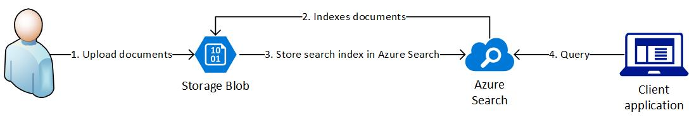
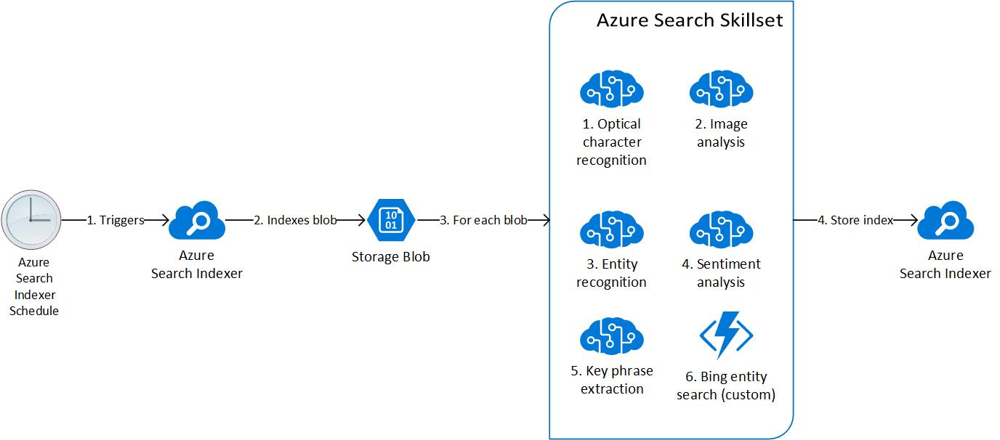

# Azure Knowledge Mining

Knowledge mining using Azure platform: Azure Search, key phrase extraction, sentiment analysis, entity recognition, optical character recognition, and image analysis.

_Figure 1. Diagram of knowledge mining architecture on Azure._

_Figure 2. Diagram of Azure search pipeline including indexer and skillset._

| Resource                                                                                                             | Usage                                                                            |
| -------------------------------------------------------------------------------------------------------------------- | -------------------------------------------------------------------------------- |
| [Azure Search Service](https://azure.microsoft.com/en-us/services/search/)                                           | The hosting service for the Search Index, Cognitive Skillset, and Search Indexer |
| [Azure Cognitive Services](https://docs.microsoft.com/en-us/azure/search/cognitive-search-attach-cognitive-services) | Used by the Cognitive Skills pipeline to process unstructured data               |
| [Azure Storage Account](https://azure.microsoft.com/en-us/services/storage/?v=18.24)                                 | Data source where raw files are stored                                           |
| [Azure Function](https://azure.microsoft.com/en-us/services/functions/)                                              | Serverless compute platform for hosting custom skill logic                    |

## Pre-requisite

- [Azure Storage Explorer](https://azure.microsoft.com/en-us/features/storage-explorer/)
- [Postman](https://www.getpostman.com/downloads/)
- [Azure CLI](https://docs.microsoft.com/en-us/cli/azure/install-azure-cli?view=azure-cli-latest)

## Getting Started

- Clone the repository

- In `./terraform`:
  - Change `prefix` in `variables.tf` because Azure Search name has to be globally unique
    - For the remainder of the documentation, the prefix `azure-km` **WILL BE ASSUMED**
    - At this time of this project, Terraform doesn't support Azure cognitive service (all-in-one). Hence, user will have to create cognitive service (all-in-one) through Azure Portal with similar naming convention as Terraform-provisioned resources (e.g. `azure-km-cogsrv`)
      - The cognitive serviec (all-in-one) is called "Cognitive Services" on Azure Marketplace
  - Run `terraform plan -out=out.tfplan`
  - Run `terraform apply out.tfplan`
  - Note the outputs of `terraform apply`

- Through Azure Storage Explorer:
  - Connect to storage account `azurekmstorage`
  - Add all sub-folders within `./data` to the storage container `azure-km-container`

- In `./function`:
  - Replace `<bing-entity-search-key>` (`/function/BingEntitySearch/index.js`, line 5) with cognitive service Entity Search API key
  - We will deploy to Azure Function using zip deployment (full list of [supported deployment technologies](https://docs.microsoft.com/en-us/azure/azure-functions/functions-deployment-technologies)):
    - Zip the function project: `zip -r function.zip *`
    - Deploy zipped function project to Azure: `az functionapp deployment source config-zip -g <resource-group-name> -n <function-app-name> --src ./function.zip`
      - E.g. `az functionapp deployment source config-zip -g azure-km-rg -n azure-km-functions --src ./function.zip`
    - Clean up and remove zipped project: `rm function.zip`
  - Start the Azure Function: `az functionapp start --name <function-app-name> --resource-group <resource-group-name>`
    - E.g. `az functionapp start --name azure-km-functions --resource-group azure-km-rg`
  - Obtain the function URL, including the function key, through the Portal

- Through Postman:
  - Import collection `./postman/cognitive_search_pipeline.postman_collection.json` and environment variables `./postman/cognitive_search_pipeline.postman_environment.json`
  - Input values for environment variables based on the below table
  - Gather `search_api_key`, `storage_connection_string`, and `cog_services_key` from the Azure Search, Azure Storage, and Azure Cognitive Service respectively through the Azure Portal
  - Run API requests `01 - Create a Blob Datasource` to `06 - Search Index`
    - The API requests that are not numerically labelled are for developmental purposes only

| **Postman Env Var Name**      | **Value**          |
|-------------------------------|--------------------|
| index_name                    | cognitive-search   |
| search_service                | azure-km-search    |
| search_api_key                | `<sanitized>`      |
| storage_connection_string     | `<sanitized>`      |
| storage_container             | azure-km-container |
| cog_services_key              | `<sanitized>`      |
| function_entity_search_url    | `<redacted>`       |

- An alternative for querying data within Azure Search is to use the [Azure Search Explorer](https://docs.microsoft.com/en-us/azure/search/search-explorer) through Azure Portal

## Next Steps

- [] Documentation
- [] Architectural diagram

## Best Practices

- When productionizing the knowledge mining solution, please consider the following points:
  - Tag each resources with appropriately (e.g. billing center, environment, etc.)
  - Understand the limitation of each Azure resource SKU and consider which SKUs are appropriate for production workload

## Gotchas

- Azure Search Explorer (Portal) doesn't support Lucene syntax
- Azure Search simple syntax doesn't support fuzzy and proximity search
- Free Azure Search tier only allows indexing 20 documents
  - Need to attach cognitive service to solve the blocker
- Azure Search `Full` query mode doesn't support negation i.e. `NOT url:*reviews*`
  - Query `sentimentScore:<0.5` doesn't work as well. Complains about `Invalid search against numeric field`
- Azure Search Text Merge skill cannot override input field

---

### PLEASE NOTE FOR THE ENTIRETY OF THIS REPOSITORY AND ALL ASSETS

1. No warranties or guarantees are made or implied.
2. All assets here are provided by me "as is". Use at your own risk. Validate before use.
3. I am not representing my employer with these assets, and my employer assumes no liability whatsoever, and will not provide support, for any use of these assets.
4. Use of the assets in this repo in your Azure environment may or will incur Azure usage and charges. You are completely responsible for monitoring and managing your Azure usage.

---

Unless otherwise noted, all assets here are authored by me. Feel free to examine, learn from, comment, and re-use (subject to the above) as needed and without intellectual property restrictions.

If anything here helps you, attribution and/or a quick note is much appreciated.
